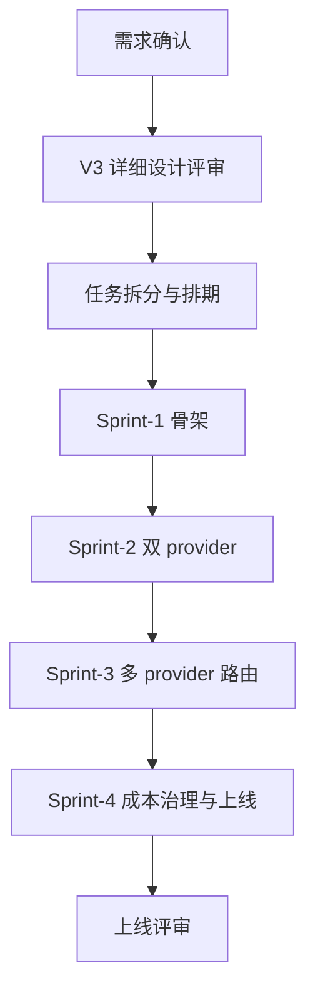
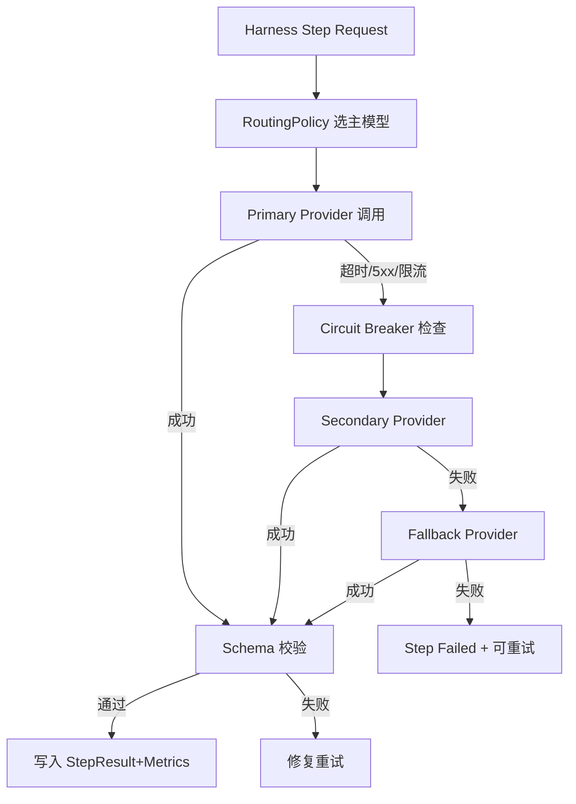
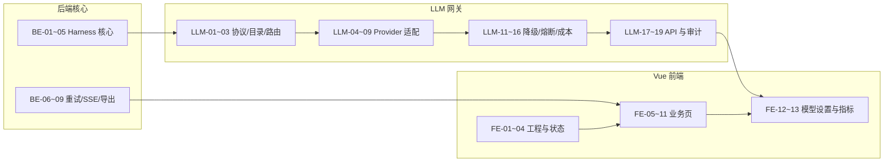
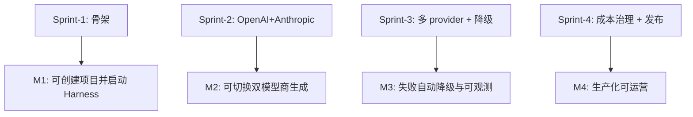
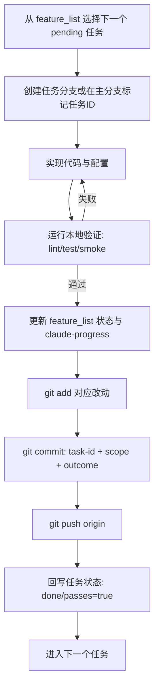
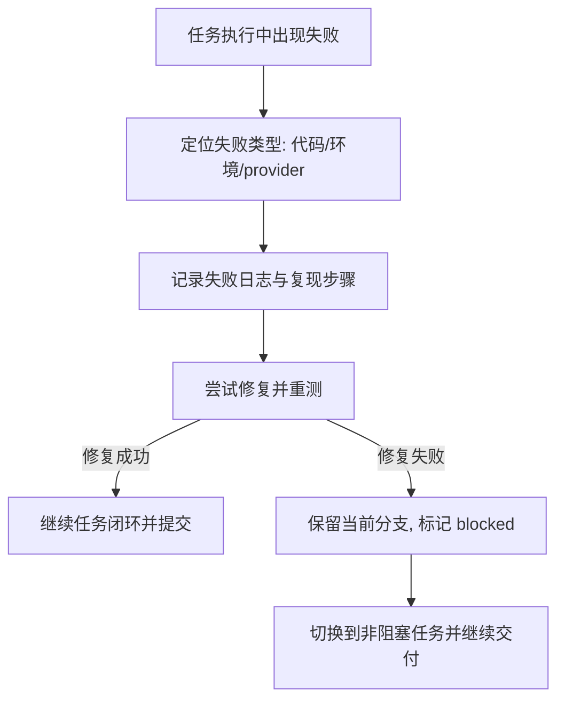

# 任务拆分流程图（V3：多模型商）

## 1. 实施主流程

```mermaid
flowchart TD
    A[需求确认] --> B[V3 详细设计评审]
    B --> C[任务拆分与排期]
    C --> D[Sprint-1 骨架]
    D --> E[Sprint-2 双 provider]
    E --> F[Sprint-3 多 provider 路由]
    F --> G[Sprint-4 成本治理与上线]
    G --> H[上线评审]
```

## 2. 运行时 LLM 路由与降级流程

```mermaid
flowchart TD
    I[Harness Step Request] --> R[RoutingPolicy 选主模型]
    R --> P[Primary Provider 调用]
    P -->|成功| O[Schema 校验]
    O -->|通过| S[写入 StepResult+Metrics]
    O -->|失败| F1[修复重试]
    P -->|超时/5xx/限流| C1[Circuit Breaker 检查]
    C1 --> B1[Secondary Provider]
    B1 -->|成功| O
    B1 -->|失败| B2[Fallback Provider]
    B2 -->|成功| O
    B2 -->|失败| E[Step Failed + 可重试]
```

## 3. 模块关键依赖

```mermaid
flowchart LR
    subgraph FE[Vue 前端]
      FE1[FE-01~04 工程与状态]
      FE2[FE-05~11 业务页]
      FE3[FE-12~13 模型设置与指标]
    end

    subgraph CORE[后端核心]
      BE1[BE-01~05 Harness 核心]
      BE2[BE-06~09 重试/SSE/导出]
    end

    subgraph LLM[LLM 网关]
      L1[LLM-01~03 协议/目录/路由]
      L2[LLM-04~09 Provider 适配]
      L3[LLM-11~16 降级/熔断/成本]
      L4[LLM-17~19 API 与审计]
    end

    BE1 --> L1 --> L2 --> L3 --> L4
    L4 --> FE3
    BE2 --> FE2
    FE1 --> FE2 --> FE3
```

## 4. Sprint 交付流

```mermaid
flowchart TD
    S1[Sprint-1: 骨架] --> M1[M1: 可创建项目并启动 Harness]
    S2[Sprint-2: OpenAI+Anthropic] --> M2[M2: 可切换双模型商生成]
    S3[Sprint-3: 多 provider + 降级] --> M3[M3: 失败自动降级与可观测]
    S4[Sprint-4: 成本治理 + 发布] --> M4[M4: 生产化可运营]
```

## 5. 按任务执行闭环（含自动提交）

```mermaid
flowchart TD
    T0[从 feature_list 选择下一个 pending 任务] --> T1[创建任务分支或在主分支标记任务ID]
    T1 --> T2[实现代码与配置]
    T2 --> T3[运行本地验证: lint/test/smoke]
    T3 -->|失败| T2
    T3 -->|通过| T4[更新 feature_list 状态与 claude-progress]
    T4 --> T5[git add 对应改动]
    T5 --> T6[git commit: task-id + scope + outcome]
    T6 --> T7[git push origin]
    T7 --> T8[回写任务状态: done/passes=true]
    T8 --> T9[进入下一个任务]
```

## 6. 任务失败与回滚流程

```mermaid
flowchart TD
    F0[任务执行中出现失败] --> F1[定位失败类型: 代码/环境/provider]
    F1 --> F2[记录失败日志与复现步骤]
    F2 --> F3[尝试修复并重测]
    F3 -->|修复成功| F4[继续任务闭环并提交]
    F3 -->|修复失败| F5[保留当前分支, 标记 blocked]
    F5 --> F6[切换到非阻塞任务并继续交付]
```
